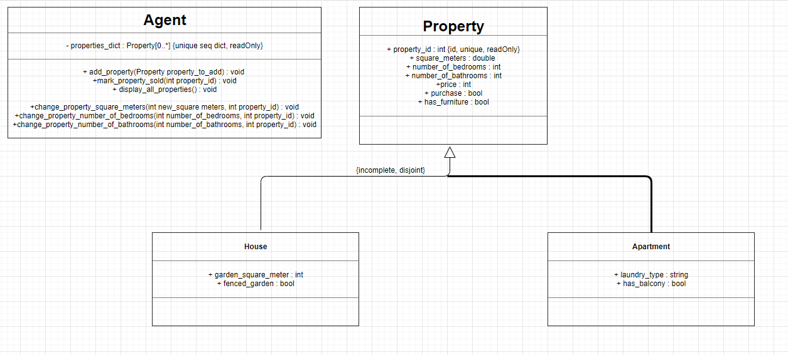
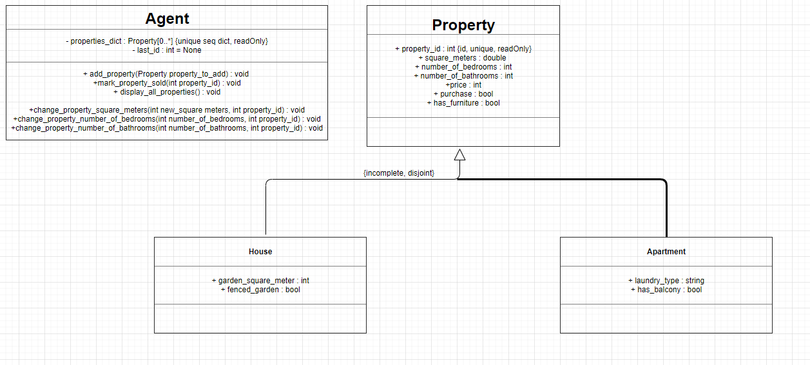
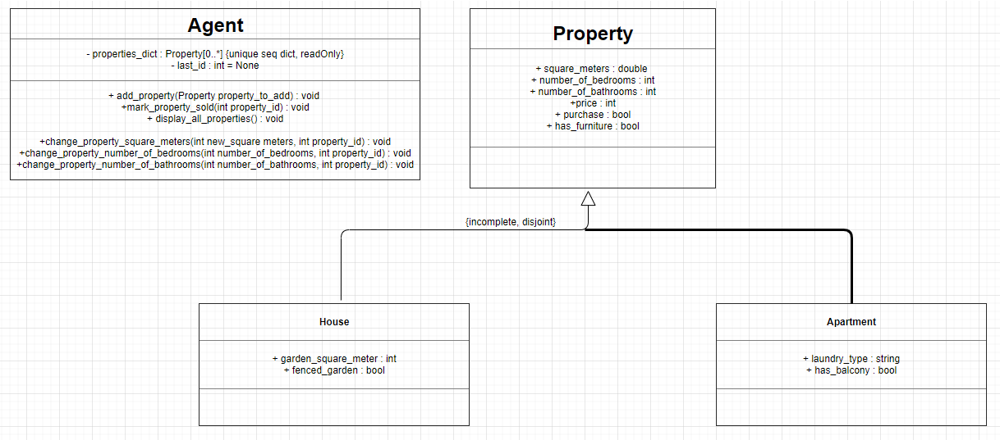
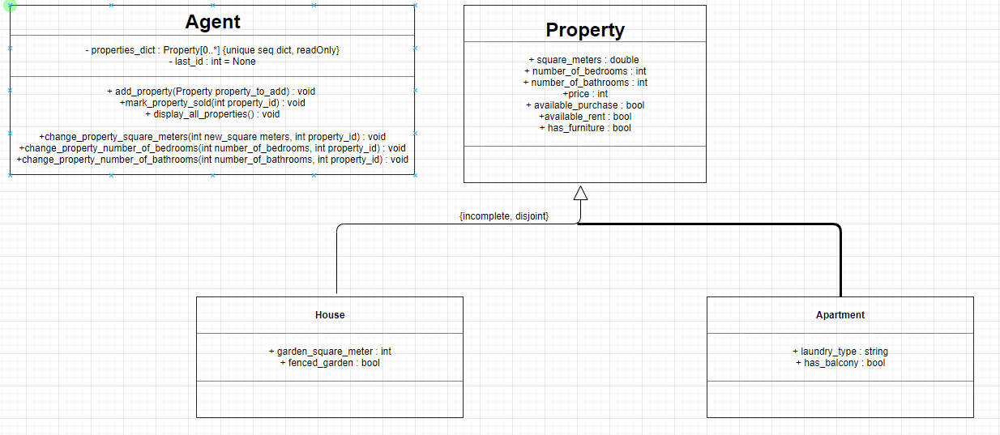
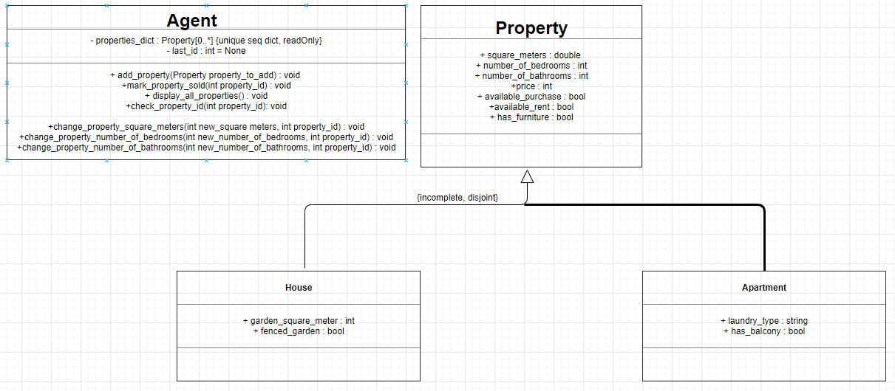
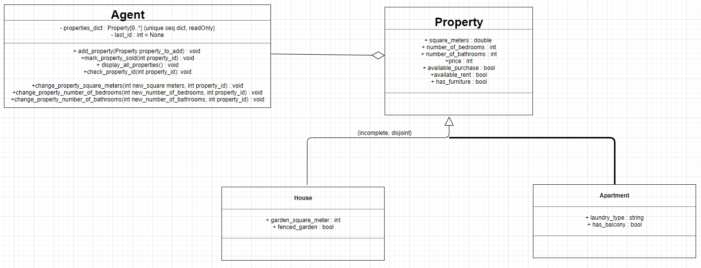
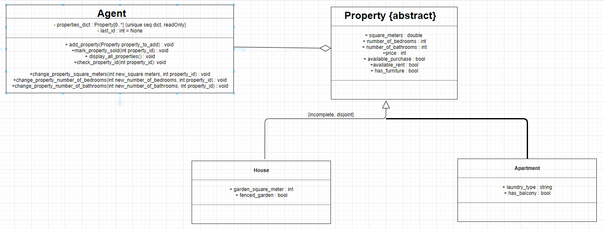

# Case study self made

## Analysis Phase

Design a real estate application that allows an agent to manage properties available for purchase or rent.
There will be 2 types of properties:

* apartments
* houses

The agent needs to be able to enter relevent details about the properties, list all currently avaiable properties and  mark a property as sold or rented.

Every property should be available for rent or purchase.
There should be different properties for houses

## Designing Phase

Version 1:

Version 2:

Version 3:

Version 4:

Version 5:

Version 6:

Version 7:

