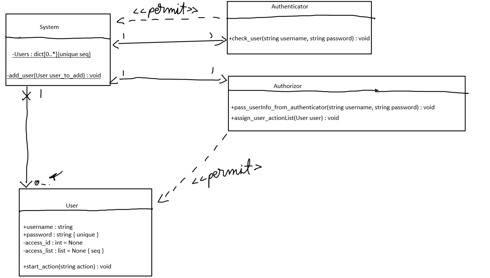

# Analysis Phase

When the program starts, the authentication process should start as well, where the user is asked about the username and password.
If the authentication process has been successfull and the user passes the Authenticator, the authorization process starts, where the Authorizor assigns a list of allowed actions to the user.

The system must store users inside a data structure where each user has a username, password and an access_id. The authenticator passes the user to the authorizor. Depending on what access_id the user has, the authorizor assigns a special list of actions to it.

# Design Phase

## Try 1:

## Try 2:

## Try 3:

## Try 4:

## Try 5:

