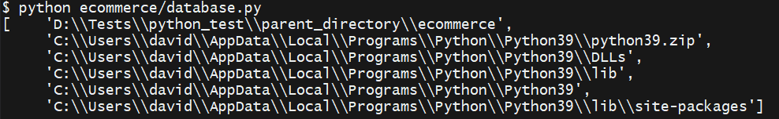
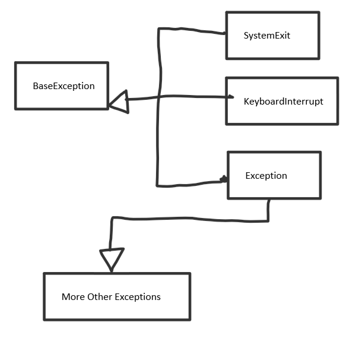

# First Python 3 OOP Book
--- 
## Chapter 1: Object-oriented Design
## Chapter 2: Objects in Python 
## Chapter 3: When Objects are Alike
## Chapter 4: Expecting the Unexpected
## Chapter 5: When to Use Object-oriented Programming
## Chapter 6: Python Data Structures
## Chapter 7: Python Object-oriented Shortcuts
## Chapter 8: Python Design Pattern I
## Chapter 9: Python Design Pattern II
## Chapter 10: Files and Strings
## Chapter 11: Testing Object-oriented Programs
## Chapter 12: Common Python 3 Libraries

---

# Chapter 1: Object-oriented Design
Basics of OOP ( what is abstraction, inheritance etc. )

---

# Chapter 2: Objects in Python 

A module is nothing but a python file.
A package is a folder with more modules inside of it. In order for a folder to be considered a package, it needs a \_\_init.py\_\_ that is normally always empty.

There are 2 types of imports:

1. Absolute imports
2. Relative imports

Let's take the following directory as example:

```
parent_directory\
    main.py
    ecommerce\
        __init__.py
        database.py
        products.py
        payments\
            __init__.py
            paypal.py
            authorizenet.py
```

Before I explain what each type of import does and how to implement each of them, I will explain what actually happens when we write import. Python uses ```sys.path``` to search for modules. This is what sys.path looks like:



So the first path is the path that our current file is inside of. The rest are default directories where modules might be stored. That means that we can add a new path to sys.path where python can look inside for modules.

#### 1. Absolute imports

When using absolute imports you must give the entire path of the module you want to import. For example if you are inside ```main.py``` and you want to import ```ecommerce/database.py``` you'll have to give the entire path, including the package name:

```Python
# Inside main.py
import ecommerce.database
# In case you only need certain things out of the module and not the entire module you can use from * import *
from ecommerce.database import Database
```

If we want to import ```main.py``` from inside of ```ecommerce/database.py``` you have to add the directory of main to sys.path otherwise it won't work.

```Python
import sys
import os

current_file = os.path.realpath(__file__)
current_dir = os.path.dirname(current_file)
parent_dir = os.path.dirname(current_dir)
sys.path.insert(0, parent_dir)

import main
```

In our case the directory of main is the parent directory, we can also manually insert the name of the directory.

#### 2. Relative imports

When using relative imports you can give the relative path to the module and you can also go back in other directories which is something that you can't do with absolute imports. Here is an example:

Let's say that you are inside ```database.py``` and you want to import ```main.py```:

```Python
# from .. import main 
from ..main import MainClass
# if you only want to import one class then use from ..main import MainClass

class Database:
    pass
```

The way you run the files that use relative imports has to be different. You have to be outside the parent directory and run it at a script ```-m``` and write the path correctly ( with . not / ):

```python -m parent_directory.ecommerce.database```

---

# Chapter 3: When Objects are Alike

Duplicate code is considered very ineffective in programming. That's why we should use inheritance when possible. Inheritance allows us to build 'is-a' relationships between objects. Abstract values are stored in the upper class while we put the specific ones in the subclass. 

All python classes are subclasses of the class namde **object**. It's just like in JavaScript where all objects in the end inherit the object Object. 
The class objects provides all the double-underscore values that every objects has end gets to use. We don't have to specify that an class inherits from object, it's set by default. However, if you want to specify that a class inherits from object, you have to use the following syntax:

```Python
class MySubClass(object):
    pass
```

## 1. Basic Inheritance

In order to create a class variable you have to use the class name when modifying it:

```Python
class Contact:
    all_contacts = list()

    def __init__(self, name, email):
        self.name = name
        self.email = email
        Contact.all_contacts.append(self)
```

In this example all_contacts is the class variable. Every time we make an instace of the class Contact, that instance is added to Contact.all_contacts. If you use ```self``` on that property you will only change it inside the instance, not inside the general class.

In order for a class to inherit another class you have to add it inside the parantheses() and it will be able to use everything that the upper class has used:

```Python
class Supplier(Contact):
    def order(self, order):
        print("If this were a real system we would send {0} order to {1}".format(
            order, self.name
        ))

c = Contact("Some Body", "somebody@example.net")
s = Supplier("Sup Plier", "supplier@example.net")

print(c.name, c.email)
print(s.name, s.email)

try:
    c.order("I need pliers")
except AttributeError:
    print("Contact doesn't have any method called order")

s.order("I need pliers")

"""
Inside the console:

Some Body somebody@example.net
Sup Plier supplier@example.net
Contact doesn't have any method called order
If this were a real system we would sen I need pliers order to Sup Plier
"""
```

## 2. Extending built-ins

In order to extend built ins you have to write the name of the built in data type/structure inside the parantehses just like when you derive from any other class:

```Python
class ContactList(list):
    def search(self, name):
        '''Return all contacts that contain the search value in their name.'''
        matching_contacts = list()
        for contact in self:
            if name in contact.name:
                matching_contacts.append(contact)
        
        return matching_contacts
```

When we write ```for contact in self```, we already know that self is the object instantiated from this class, and since we derive the class ContactList from list, we know that we can iterate over a ContactList as if we would iterate over any other normal list. We also have all the other methods that a normal list has since we are deriving the class ContactList from it.

Here is an example of how we can use extended built ins:

```Python
class Contact:
    all_contacts = ContactList()

    def __init__(self, name, email):
        self.name = name
        self.email = email
        Contact.all_contacts.append(self)

c1 = Contact("John A", "johna@example.net")
c2 = Contact("John B", "johnb@example.net")
c3 = Contact("Jenna C", "jennac@example.net")

for c in Contact.all_contacts.search("John"):
    print(c.name)

"""
Inside the console:

John A
John B

"""
```

You can extend any kind of built in without any problem. Here is an example of extending a dict:

```Python
class LongNameDict(dict):
    def longest_key(self):
        longest = None
        for key in self.keys():
           if not longest or len(key) > len(longest):
               longest = key
           else:
               continue
        
        return longest

longkeys = LongNameDict()
longkeys["hello"] = 1
longkeys["longest yet"] = 5
longkeys["hello2"] = "world"

print(longkeys.longest_key()) # result : longest yet
```

Here again, when we write ```self.keys()``` we mean the instance of the class LongNameDict, that inherits from dict. We can iterate over its instances as we can over every other dict since it inherits it.

## 3. Overriding and super

In order to override a method you don't need any syntax, you just have to write the method normally and when the instance of the subclass will use that method, the overriden method will have priority for the instantiated sub class.

```Python
class Contact:
    all_contacts = list()

    def __init__(self, name, email):
        self.name = name
        self.email = email
        Contact.all_contacts.append(self)

class Friend(Contact):
    def __init__(self, name, email, phone):
        self.name = name
        self.email = email
        self.phone = phone
```

You can see in our example that we are overriding the method ```__init__```.
The bad thing about overriding this method in our case is that we have to repeat code since we have to declare name & email twice. 
In order to not repeat code and make it look cleaner you can use the ```super()``` method that will call an object that servers as an instance of the upper class where you can call any method you want:

```Python
class Friend(Contact):
    def __init__(self, name, email, phone):
        super().__init__(name, email)
        self.phone = phone
```

In this case, instead of rewriting everything, we just called the ```__init__``` method from the upper class to do the work for us.

## 4. Multiple Inheritance

A class can inherit from multiple parent classes. Here is an example:

```Python
class Contact:
    all_contacts = list()

    def __init__(self, name, email):
        self.name = name
        self.email = email
        Contact.all_contacts.append(self)

class MailSender:
    def send_email(self, message):
        print("Sending email to {0}".format(self.email))

        # Add e-mail logic here

class EmailableContact(Contact, MailSender):
    pass

e = EmailableContact("John Smith", "jsmith@example.net")
print(Contact.all_contacts)
e.send_email("Hello, test e-mail here")
```

The problem that we have with multiple inheritance is that it's very hard to debug it and it's very easy to make mistakes. **It is recommended not to use multiple inheritance.**

**This type of inheritance creates a diamond**:

```Python
class BaseClass:
    num_base_calls = 0
    def call_me(self):
        print("Calling method in Base Class")
        self.num_base_calls += 1

class LeftSubclass(BaseClass):
    num_left_calls = 0
    def call_me(self):
        BaseClass.call_me(self)

        print("Calling method on Left Subclass")
        self.num_left_calls += 1
    
class RightSubclass(BaseClass):
    num_right_calls = 0
    def call_me(self):
        BaseClass.call_me(self)

        print("Calling method on Right Subclass.")
        self.num_right_calls += 1

class Subclass(LeftSubclass, RightSubclass):
    num_sub_calls = 0
    def call_me(self):
        LeftSubclass.call_me(self)
        RightSubclass.call_me(self)

        print("Calling method on Subclass")
        self.num_sub_calls += 1

s = Subclass()
s.call_me()

print(s.num_sub_calls)
print(s.num_left_calls)
print(s.num_right_calls)
print(s.num_base_calls)

"""
Console:

Calling method in Base Class
Calling method on Left Subclass
Calling method in Base Class
Calling method on Right Subclass.
Calling method on Subclass
1
1
1
2

"""
```

All classes that don't inherit from any specific class inherit from the object **object**, meaning that we are transforming this into a diamond. You can see that the base class has been called two times. The problem with this is that we  might have a database inside the baseclass that makes transcations twice since it's called twice. This would be very hard to debug and it can cause a lot of damage ( that's why it's best to not use multiple inheritance ).
We can solve this problem by using **super()**. In this case **super() doesn't go to the 'upper-class', it target the 'next'-class**.

```Python
class BaseClass:
    num_base_calls = 0
    def call_me(self):
        print("Calling method in Base Class")
        self.num_base_calls += 1

class LeftSubclass(BaseClass):
    num_left_calls = 0
    def call_me(self):
        super().call_me()

        print("Calling method on Left Subclass")
        self.num_left_calls += 1
    
class RightSubclass(BaseClass):
    num_right_calls = 0
    def call_me(self):
        super().call_me()

        print("Calling method on Right Subclass.")
        self.num_right_calls += 1

class Subclass(LeftSubclass, RightSubclass):
    num_sub_calls = 0
    def call_me(self):
        super().call_me()

        print("Calling method on Subclass")
        self.num_sub_calls += 1

s = Subclass()
s.call_me()

print(s.num_sub_calls)
print(s.num_left_calls)
print(s.num_right_calls)
print(s.num_base_calls)

"""
Console:

Calling method in Base Class
Calling method on Right Subclass.
Calling method on Left Subclass
Calling method on Subclass
1
1
1
1

"""
```

You can see that super() solved our problem since when we call super() on the left diamond class it will go to the right super class, meaning that the base class won't be called twice.

We still have some problems with this. We don't always know what class on which side of the diamond will be the first target of super(), that's why we should use kwargs instead of passing arguments down manually:

```Python
class Contact:
    all_contacts = list()

    def __init__(self, name='', email='', **kwargs):
        super().__init__(**kwargs)

        self.name = name
        self.email = email
        self.all_contacts.append(self)

class AddressHolder:
    def __init__(self, street='', city='', state='', code='', **kwargs):
        super().__init__(**kwargs)

        self.street = street
        self.city = city
        self.state = state
        self.code = code

class Friend(Contact, AddressHolder):
    def __init__(self, phone="", **kwargs):
        super().__init__(**kwargs)
        self.phone = phone
```

This will still make the code difficult and very prone to bugs but easier easier to debug. We can do any of the following:

* Include phone in kwargs inside the Friend class
* Make phone an explicit keyword but update it to kwargs befoer calling super
* Make phone an explicit keyword but pass it down to super with kwargs, togheter. ( ```super().__init__(phone=phone, **kwargs))``` )

## 5. Polymorphism

There is no real polymorphism in python because of duck typing. Duck typing is in the dynamic nature of python ( and many other languages like javascript, Lisp, Lua, Perl, Groovy etc.)

Here is an example of duck typing:

```Python
class PyCharm:
    def execute(self):
        print("Compiling")
        print("Running")

class MyEditor:
    def execute(self):
        print("Spell check")
        print("Convention Check")
        print("Compiling")
        print("Running")

class some_random_class:
    def execute(self):
        print("Execute something")

class Laptop:
    def code(self, ide):
        ide.execute()

ide = some_random_class()

lapl = Laptop()
lapl.code(ide)
```

You can see that we can pass anything we inside the ide argument if it matches the patterns it has to run ( if it has a .execute method ).

Here is a better example of polymorphism where python knows what .play command to execute depending on the object that it is calling that method:

```Python
class AudioFile:
    def __init__(self, filename):
        if not filename.endswith(self. ext):
            raise Exception("Invalid file format")

        self.filename = filename
    
class MP3File(AudioFile):
    ext = "mp3"
    def play(self):
        print("Playing {0} as mp3".format(self.filename))

class WavFile(AudioFile):
    ext = "wav"
    def play(self):
        print("Playing {0}".format(self.filename))
    
class OggFile(AudioFile):
    ext = "ogg"
    def play(self):
        print("Playing {0} as ogg".format(self.filename))

ogg = OggFile("myfile.ogg")
ogg.play()

mp3 = MP3File("myfile.mp3")
mp3.play()

not_an_mp3 = MP3File("myfile.ogg")
```

---

# Chapter 4: Expecting the Unexpected

In order to handle multiple types of exceptions at once you can use the following syntax:

```Python
try:
    if (a < b):
        raise ValueError
    else:
        raise TypeError
except (ValueError, TypeError):
    print("The following errors have been handled : {0}, {1}".format(
        ValueError.__class__.__name__,
        TypeError.__class__.__name__,
    ))
```

Exceptions can also be captured inside variables so you can handle them in detail if you need to:

```Python
try:
    # Code
except ValueError as e:
    # Code
```

On top of ```try``` and ```except``` we also have ```else``` and ```finally```. The ```else``` block happens every time there are no exceptions raised while ```finally``` happens all the time at the end of everything.

```Python
try:
    print("I might raise an exception")

    if random.choice(list(range(1, 11))) % 2 == 0:
        print("I didn't raise any exceptions")
    else:
        raise ValueError
except ValueError:
    print("I will handle the ValueError")
else:
    print("No errors have been raised")
finally:
    print("You will always see this")
```

In order to create your own exceptions you have to know how the exception hierarchy looks like



You can see that SystemExit, KeyboardInterrupt and Exception all 3 inherit from the base class BaseException.

SystemExit is raised when the program is naturally closed ( usually by using sys.exit ). KeyboardInterrupt is raised when the program is interrupted by a series of keys ( ctrl + c for example ).
Exception is also a base class for most exceptions that we see ( for example ValueError, TypeError, etc. ). It's not a wise thing to use the ```except``` keyword without specifying what you want to except as an error since everything can be an error in that case: SystemExist, KeyboardInterrupt, Exception. You always want to specify what you want to except. 
The exception logic goes from the most 'niched' exception to the most general ones. Example:

```Python
except PasswordTooLong:
    pass
except PasswordNotCorrect:
    pass
except Exception:
    pass
```

In this example we have first checked if the password is too long first since the user will never be able to log in if the password doesn't match the patterns of the other passwords in the db as well, so there's no point in searching. Afterwise we excepted the PasswordNotCorrect since the user's password pattern was correct, but the password was wrong. In the end we excepted all the other general exceptions that might occur in some way or another.

Here is how you create your own exception.

You can create a very basic exception with no arguments and no overriding by just creating a class that inherits Exception:

```Python
class CustomException(Exception) : pass
```

This will behave like a normal exception since it derives from exception. You will have an ```__init__(*args)``` and everything, just like any other normal exceptions.

You can also override the Exception class and add special properties and methods to your custom exception:

```Python
class CustomException(Exception):
    def __init__(self, message, value):
        self.message = message
        self.value = value

    def custom_method(self):
        print("This is a custom method")

try:
    # Code
    raise CustomException("This message will be raised", 25)
except CustomException as e:
    e.custom_method()
    print(e.message)
    print(e.value)
```

You can almost always use if-else statements instead of try-except clauses. The good thing about handling exceptions is that you can easily keep track of the flow of the code and manage it better.

# Chapter 5: When to use object-oriented programming

Sometimes we don't need to make create classes, sometimes it's better to just stick to variables and functions.

Objects are things that have both data and behavior. If you only work with data you should use data-structures like lists, sets or tuples. On the other hand, if you only work with behavior then you should use functions. Let's look at the following example:

```Python
import math

square = [(1, 1), (1, 2), (2, 2), (2, 1)]

def distance(p1, p2):
    return math.sqrt((p1[0]-p2[0])**2 + (p1[1] - p2[1])**2)

def perimeter(polygon):
    perimeter = 0 
    points = polygon + [polygon[0]]
    for i in range(len(polygon)):
        perimeter += distance(points[i], points[i+1])
    
    return perimeter

print(perimeter(square))
```

You can see that we haven't used any classes, just standard variables and functions. Is it even worth it to make a class here ? Let's see !

```Python
import math

class Point:
    def __init__(self, x, y):
        self.x = x
        self.y = y

    def distance(self, p2):
        return math.sqrt((self.x - p2.x)**2 + (self.y - p2.y)**2)

class Polygon:
    def __init__(self):
        self.vertices = list()
    
    def add_point(self, point):
        self.vertices.append((point))

    def perimeter(self):
        perimeter = 0
        points = self.vertices + [self.vertices[0]]

        for i in range((len(self.vertices))):
            perimeter += points[i].distance(points[i+1])
        
        return perimeter

square = Polygon()
square.add_point(Point(1, 1))
square.add_point(Point(1, 2))
square.add_point(Point(2, 2))
square.add_point(Point(2, 1))

print(square.perimeter())
```

You can see that in this case, we wrote more code, but this code is much more easier to read and to expand. In the second object we don't know exactly how the list should look like, it's not intuitive that we have to write the points inside tuples where the first value is the x-coordinate and the second value is the y-coordinate. We don't exactly know how the function perimeter works. We need a lot of external documentation.

In contrast to the first example, the oop code is self documenting.

Code length however is not the best indicator for code complexity. **The key lies in simplicity when in comes to OOP**. You should never write a one-liner for example since you most probably won't be able to understand it the day after and it will be very hard for other programmers to read it.

If you have a certain set of values that constantly work with a certain set of function then it is most probably in your best interest to wrap them inside a function. In our case, maybe we only need to calculate the perimeter of the polygon once, maybe we don't have 100 polygon objects or maybe we are sure that we will never need to extend the polygon class, to add for example color or texture properties to it, or some other methods. In that case we can just use some simple functions, there is no need for classes if we know that we will never extend that class and we only need one short function.

When making the decision if you should or shouldn't use classes, it always comes down to what you are going to do with them in the future.

On top of that you also have to pay attention to the interaction between objects. If inheritance or composition comes into play then you might need to rethink your decision in form of design and structure.

> Don't rush to use an object just because you can use an object, but never neglect to create a class when you need to use a class.

In many programming languages we have the concept of encapsulation, where you set a property to private and then you change its basic behaviors through setters and getters. You are basically protecting the property from the outside of the class while controlling the data that comes into it and the data that gets out of it.

We can do that in python as well ( although we can't really set a property to be private )

Here is an example:

```Python
class Silly:
    def __init__(self):
        self._silly = None

    def _get_silly(self):
        print("You are getting silly")
        return self._silly

    def _set_silly(self, value):
        print("You are making silly {0}".format(value))
        self._silly = value

    def _del_silly(self):
        print("You killed silly!")
        del self._silly

    silly = property(_get_silly, _set_silly, _del_silly, "This is a silly property")
```

In this case we have a 'Silly' class that does nothing but tell you when you try to get the value of the 'private' silly property, when you set it to a new value and when you delete it.

In order to create a set these behaviors for the "private" property "silly" you need to use the property method.

```Python
property_name = property(GETTERS_FUNCTION, SETTER_FUNCTION, DELETE_FUNCTION, DOCSTRING)
```

Another way of doing this is using decorators:

```Python
class Foo:
    def __init__(self):
        self._foo = None

    @property
    def foo(self):
        """This docstring for the entire property is written inside the getter method"""
        return self._foo

    @foo.setter
    def foo(self, value):
        self._foo = value

    @foo.delete
    def foo(self):
        del self._foo
```

The ```@property``` decorator is also the setter for the property and it also has the docstring inside it. The setter and the delete operator are both used by writing the name of the property and then .setter or .delete.

In general you can always use a standard normal property if you don't need to control/add behavior to that property.

In the following example you can see why a property might be useful. 

```Python
from urllib.request import urlopen

class WebPage:
    def __init__(self, url):
        self.url = url
        self._content = None

    @property
    def content(self):
        if not self._content:
            print("Retrieving New Page ... ")
            self._content = urlopen(self.url).read()

        return self._content
```

In this example we have used a getter for the content so we don't always download it from the url. We just download it once ( which at first it might take some time ) and then we check if it's None and if it's not None which will be the case after we've downloaded it, we will just return the content.