# First Python 3 OOP Book
--- 
## Chapter 1: Object-oriented Design
## Chapter 2: Objects in Python 
## Chapter 3: When Objects are Alike
## Chapter 4: Expecting the Unexpected
## Chapter 5: When to Use Object-oriented Programming
## Chapter 6: Python Data Structures
## Chapter 7: Python Object-oriented Shortcuts
## Chapter 8: Python Design Pattern I
## Chapter 9: Python Design Pattern II
## Chapter 10: Files and Strings
## Chapter 11: Testing Object-oriented Programs
## Chapter 12: Common Python 3 Libraries

---

# Chapter 1: Object-oriented Design
Basics of OOP ( what is abstraction, inheritance etc. )

---

# Chapter 2: Objects in Python 

A module is nothing but a python file.
A package is a folder with more modules inside of it. In order for a folder to be considered a package, it needs a \_\_init.py\_\_ that is normally always empty.

There are 2 types of imports:

1. Absolute imports
2. Relative imports

Let's take the following directory as example:

```
parent_directory\
    main.py
    ecommerce\
        __init__.py
        database.py
        products.py
        payments\
            __init__.py
            paypal.py
            authorizenet.py
```

Before I explain what each type of import does and how to implement each of them, I will explain what actually happens when we write import. Python uses ```sys.path``` to search for modules. This is what sys.path looks like:


So the first path is the path that our current file is inside of. The rest are default directories where modules might be stored. That means that we can add a new path to sys.path where python can look inside for modules.

#### 1. Absolute imports

When using absolute imports you must give the entire path of the module you want to import. For example if you are inside ```main.py``` and you want to import ```ecommerce/database.py``` you'll have to give the entire path, including the package name:

```Python
# Inside main.py
import ecommerce.database
# In case you only need certain things out of the module and not the entire module you can use from * import *
from ecommerce.database import Database
```

If we want to import ```main.py``` from inside of ```ecommerce/database.py``` you have to add the directory of main to sys.path otherwise it won't work.

```Python
import sys
import os

current_file = os.path.realpath(__file__)
current_dir = os.path.dirname(current_file)
parent_dir = os.path.dirname(current_dir)
sys.path.insert(0, parent_dir)

import main
```

In our case the directory of main is the parent directory, we can also manually insert the name of the directory.

#### 2. Relative imports

When using relative imports you can give the relative path to the module and you can also go back in other directories which is something that you can't do with absolute imports. Here is an example:

Let's say that you are inside ```database.py``` and you want to import ```main.py```:

```Python
# from .. import main 
from ..main import MainClass
# if you only want to import one class then use from ..main import MainClass

class Database:
    pass
```

The way you run the files that use relative imports has to be different. You have to be outside the parent directory and run it at a script ```-m``` and write the path correctly ( with . not / ):

```python -m parent_directory.ecommerce.database```

---

# Chapter 3: When Objects are Alike

Duplicate code is considered very ineffective in programming. That's why we should use inheritance when possible. Inheritance allows us to build 'is-a' relationships between objects. Abstract values are stored in the upper class while we put the specific ones in the subclass. 

All python classes are subclasses of the class namde **object**. It's just like in JavaScript where all objects in the end inherit the object Object. 
The class objects provides all the double-underscore values that every objects has end gets to use. We don't have to specify that an class inherits from object, it's set by default. However, if you want to specify that a class inherits from object, you have to use the following syntax:

```Python
class MySubClass(object):
    pass
```

## 1. Basic Inheritance

In order to create a class variable you have to use the class name when modifying it:

```Python
class Contact:
    all_contacts = list()

    def __init__(self, name, email):
        self.name = name
        self.email = email
        Contact.all_contacts.append(self)
```

In this example all_contacts is the class variable. Every time we make an instace of the class Contact, that instance is added to Contact.all_contacts. If you use ```self``` on that property you will only change it inside the instance, not inside the general class.

In order for a class to inherit another class you have to add it inside the parantheses() and it will be able to use everything that the upper class has used:

```Python
class Supplier(Contact):
    def order(self, order):
        print("If this were a real system we would send {0} order to {1}".format(
            order, self.name
        ))

c = Contact("Some Body", "somebody@example.net")
s = Supplier("Sup Plier", "supplier@example.net")

print(c.name, c.email)
print(s.name, s.email)

try:
    c.order("I need pliers")
except AttributeError:
    print("Contact doesn't have any method called order")

s.order("I need pliers")

"""
Inside the console:

Some Body somebody@example.net
Sup Plier supplier@example.net
Contact doesn't have any method called order
If this were a real system we would sen I need pliers order to Sup Plier
"""
```

## 2. Extending built-ins

In order to extend built ins you have to write the name of the built in data type/structure inside the parantehses just like when you derive from any other class:

```Python
class ContactList(list):
    def search(self, name):
        '''Return all contacts that contain the search value in their name.'''
        matching_contacts = list()
        for contact in self:
            if name in contact.name:
                matching_contacts.append(contact)
        
        return matching_contacts
```

When we write ```for contact in self```, we already know that self is the object instantiated from this class, and since we derive the class ContactList from list, we know that we can iterate over a ContactList as if we would iterate over any other normal list. We also have all the other methods that a normal list has since we are deriving the class ContactList from it.

Here is an example of how we can use extended built ins:

```Python
class Contact:
    all_contacts = ContactList()

    def __init__(self, name, email):
        self.name = name
        self.email = email
        Contact.all_contacts.append(self)

c1 = Contact("John A", "johna@example.net")
c2 = Contact("John B", "johnb@example.net")
c3 = Contact("Jenna C", "jennac@example.net")

for c in Contact.all_contacts.search("John"):
    print(c.name)

"""
Inside the console:

John A
John B

"""
```

You can extend any kind of built in without any problem. Here is an example of extending a dict:

```Python
class LongNameDict(dict):
    def longest_key(self):
        longest = None
        for key in self.keys():
           if not longest or len(key) > len(longest):
               longest = key
           else:
               continue
        
        return longest

longkeys = LongNameDict()
longkeys["hello"] = 1
longkeys["longest yet"] = 5
longkeys["hello2"] = "world"

print(longkeys.longest_key()) # result : longest yet
```

Here again, when we write ```self.keys()``` we mean the instance of the class LongNameDict, that inherits from dict. We can iterate over its instances as we can over every other dict since it inherits it.

## 3. Overriding and super

In order to override a method you don't need any syntax, you just have to write the method normally and when the instance of the subclass will use that method, the overriden method will have priority for the instantiated sub class.

```Python
class Contact:
    all_contacts = list()

    def __init__(self, name, email):
        self.name = name
        self.email = email
        Contact.all_contacts.append(self)

class Friend(Contact):
    def __init__(self, name, email, phone):
        self.name = name
        self.email = email
        self.phone = phone
```

You can see in our example that we are overriding the method ```__init__```.
The bad thing about overriding this method in our case is that we have to repeat code since we have to declare name & email twice. 
In order to not repeat code and make it look cleaner you can use the ```super()``` method that will call an object that servers as an instance of the upper class where you can call any method you want:

```Python
class Friend(Contact):
    def __init__(self, name, email, phone):
        super().__init__(name, email)
        self.phone = phone
```

In this case, instead of rewriting everything, we just called the ```__init__``` method from the upper class to do the work for us.

## 4. Multiple Inheritance

A class can inherit from multiple parent classes. Here is an example:

```Python
class Contact:
    all_contacts = list()

    def __init__(self, name, email):
        self.name = name
        self.email = email
        Contact.all_contacts.append(self)

class MailSender:
    def send_email(self, message):
        print("Sending email to {0}".format(self.email))

        # Add e-mail logic here

class EmailableContact(Contact, MailSender):
    pass

e = EmailableContact("John Smith", "jsmith@example.net")
print(Contact.all_contacts)
e.send_email("Hello, test e-mail here")
```

The problem that we have with multiple inheritance is that it's very hard to debug it and it's very easy to make mistakes. **It is recommended not to use multiple inheritance.**

**This type of inheritance creates a diamond**:

```Python
class BaseClass:
    num_base_calls = 0
    def call_me(self):
        print("Calling method in Base Class")
        self.num_base_calls += 1

class LeftSubclass(BaseClass):
    num_left_calls = 0
    def call_me(self):
        BaseClass.call_me(self)

        print("Calling method on Left Subclass")
        self.num_left_calls += 1
    
class RightSubclass(BaseClass):
    num_right_calls = 0
    def call_me(self):
        BaseClass.call_me(self)

        print("Calling method on Right Subclass.")
        self.num_right_calls += 1

class Subclass(LeftSubclass, RightSubclass):
    num_sub_calls = 0
    def call_me(self):
        LeftSubclass.call_me(self)
        RightSubclass.call_me(self)

        print("Calling method on Subclass")
        self.num_sub_calls += 1

s = Subclass()
s.call_me()

print(s.num_sub_calls)
print(s.num_left_calls)
print(s.num_right_calls)
print(s.num_base_calls)

"""
Console:

Calling method in Base Class
Calling method on Left Subclass
Calling method in Base Class
Calling method on Right Subclass.
Calling method on Subclass
1
1
1
2

"""
```

All classes that don't inherit from any specific class inherit from the object **object**, meaning that we are transforming this into a diamond. You can see that the base class has been called two times. The problem with this is that we  might have a database inside the baseclass that makes transcations twice since it's called twice. This would be very hard to debug and it can cause a lot of damage ( that's why it's best to not use multiple inheritance ).
We can solve this problem by using **super()**. In this case **super() doesn't go to the 'upper-class', it target the 'next'-class**.

```Python
class BaseClass:
    num_base_calls = 0
    def call_me(self):
        print("Calling method in Base Class")
        self.num_base_calls += 1

class LeftSubclass(BaseClass):
    num_left_calls = 0
    def call_me(self):
        super().call_me()

        print("Calling method on Left Subclass")
        self.num_left_calls += 1
    
class RightSubclass(BaseClass):
    num_right_calls = 0
    def call_me(self):
        super().call_me()

        print("Calling method on Right Subclass.")
        self.num_right_calls += 1

class Subclass(LeftSubclass, RightSubclass):
    num_sub_calls = 0
    def call_me(self):
        super().call_me()

        print("Calling method on Subclass")
        self.num_sub_calls += 1

s = Subclass()
s.call_me()

print(s.num_sub_calls)
print(s.num_left_calls)
print(s.num_right_calls)
print(s.num_base_calls)

"""
Console:

Calling method in Base Class
Calling method on Right Subclass.
Calling method on Left Subclass
Calling method on Subclass
1
1
1
1

"""
```

You can see that super() solved our problem since when we call super() on the left diamond class it will go to the right super class, meaning that the base class won't be called twice.

We still have some problems with this. We don't always know what class on which side of the diamond will be the first target of super(), that's why we should use kwargs instead of passing arguments down manually:

```Python
class Contact:
    all_contacts = list()

    def __init__(self, name='', email='', **kwargs):
        super().__init__(**kwargs)

        self.name = name
        self.email = email
        self.all_contacts.append(self)

class AddressHolder:
    def __init__(self, street='', city='', state='', code='', **kwargs):
        super().__init__(**kwargs)

        self.street = street
        self.city = city
        self.state = state
        self.code = code

class Friend(Contact, AddressHolder):
    def __init__(self, phone="", **kwargs):
        super().__init__(**kwargs)
        self.phone = phone
```

This will still make the code difficult and very prone to bugs but easier easier to debug. We can do any of the following:

* Include phone in kwargs inside the Friend class
* Make phone an explicit keyword but update it to kwargs befoer calling super
* Make phone an explicit keyword but pass it down to super with kwargs, togheter. ( ```super().__init__(phone=phone, **kwargs))``` )

## 5. Polymorphism

There is no real polymorphism in python because of duck typing. Duck typing is in the dynamic nature of python ( and many other languages like javascript, Lisp, Lua, Perl, Groovy etc.)

Here is an example of duck typing:

```Python
class PyCharm:
    def execute(self):
        print("Compiling")
        print("Running")

class MyEditor:
    def execute(self):
        print("Spell check")
        print("Convention Check")
        print("Compiling")
        print("Running")

class some_random_class:
    def execute(self):
        print("Execute something")

class Laptop:
    def code(self, ide):
        ide.execute()

ide = some_random_class()

lapl = Laptop()
lapl.code(ide)
```

You can see that we can pass anything we inside the ide argument if it matches the patterns it has to run ( if it has a .execute method ).

Here is a better example of polymorphism where python knows what .play command to execute depending on the object that it is calling that method:

```Python
class AudioFile:
    def __init__(self, filename):
        if not filename.endswith(self. ext):
            raise Exception("Invalid file format")

        self.filename = filename
    
class MP3File(AudioFile):
    ext = "mp3"
    def play(self):
        print("Playing {0} as mp3".format(self.filename))

class WavFile(AudioFile):
    ext = "wav"
    def play(self):
        print("Playing {0}".format(self.filename))
    
class OggFile(AudioFile):
    ext = "ogg"
    def play(self):
        print("Playing {0} as ogg".format(self.filename))

ogg = OggFile("myfile.ogg")
ogg.play()

mp3 = MP3File("myfile.mp3")
mp3.play()

not_an_mp3 = MP3File("myfile.ogg")
```

---

# Chapter 4: Expecting the Unexpected

In order to handle multiple types of exceptions at once you can use the following syntax:

```Python
try:
    if (a < b):
        raise ValueError
    else:
        raise TypeError
except (ValueError, TypeError):
    print("The following errors have been handled : {0}, {1}".format(
        ValueError.__class__.__name__,
        TypeError.__class__.__name__,
    ))
```

Exceptions can also be captured inside variables so you can handle them in detail if you need to:

```Python
try:
    # Code
except ValueError as e:
    # Code
```

On top of ```try``` and ```except``` we also have ```else``` and ```finally```. The ```else``` block happens every time there are no exceptions raised while ```finally``` happens all the time at the end of everything.

```Python
try:
    print("I might raise an exception")

    if random.choice(list(range(1, 11))) % 2 == 0:
        print("I didn't raise any exceptions")
    else:
        raise ValueError
except ValueError:
    print("I will handle the ValueError")
else:
    print("No errors have been raised")
finally:
    print("You will always see this")
```

In order to create your own exceptions you have to know how the exception hierarchy looks like


You can see that SystemExit, KeyboardInterrupt and Exception all 3 inherit from the base class BaseException.

SystemExit is raised when the program is naturally closed ( usually by using sys.exit ). KeyboardInterrupt is raised when the program is interrupted by a series of keys ( ctrl + c for example ).
Exception is also a base class for most exceptions that we see ( for example ValueError, TypeError, etc. ). It's not a wise thing to use the ```except``` keyword without specifying what you want to except as an error since everything can be an error in that case: SystemExist, KeyboardInterrupt, Exception. You always want to specify what you want to except. 
The exception logic goes from the most 'niched' exception to the most general ones. Example:

```Python
except PasswordTooLong:
    pass
except PasswordNotCorrect:
    pass
except Exception:
    pass
```

In this example we have first checked if the password is too long first since the user will never be able to log in if the password doesn't match the patterns of the other passwords in the db as well, so there's no point in searching. Afterwise we excepted the PasswordNotCorrect since the user's password pattern was correct, but the password was wrong. In the end we excepted all the other general exceptions that might occur in some way or another.

Here is how you create your own exception.

You can create a very basic exception with no arguments and no overriding by just creating a class that inherits Exception:

```Python
class CustomException(Exception) : pass
```

This will behave like a normal exception since it derives from exception. You will have an ```__init__(*args)``` and everything, just like any other normal exceptions.

You can also override the Exception class and add special properties and methods to your custom exception:

```Python
class CustomException(Exception):
    def __init__(self, message, value):
        self.message = message
        self.value = value

    def custom_method(self):
        print("This is a custom method")

try:
    # Code
    raise CustomException("This message will be raised", 25)
except CustomException as e:
    e.custom_method()
    print(e.message)
    print(e.value)
```

You can almost always use if-else statements instead of try-except clauses. The good thing about handling exceptions is that you can easily keep track of the flow of the code and manage it better.

# Chapter 5: When to use object-oriented programming

Sometimes we don't need to make create classes, sometimes it's better to just stick to variables and functions.

Objects are things that have both data and behavior. If you only work with data you should use data-structures like lists, sets or tuples. On the other hand, if you only work with behavior then you should use functions. Let's look at the following example:

```Python
import math

square = [(1, 1), (1, 2), (2, 2), (2, 1)]

def distance(p1, p2):
    return math.sqrt((p1[0]-p2[0])**2 + (p1[1] - p2[1])**2)

def perimeter(polygon):
    perimeter = 0 
    points = polygon + [polygon[0]]
    for i in range(len(polygon)):
        perimeter += distance(points[i], points[i+1])
    
    return perimeter

print(perimeter(square))
```

You can see that we haven't used any classes, just standard variables and functions. Is it even worth it to make a class here ? Let's see !

```Python
import math

class Point:
    def __init__(self, x, y):
        self.x = x
        self.y = y

    def distance(self, p2):
        return math.sqrt((self.x - p2.x)**2 + (self.y - p2.y)**2)

class Polygon:
    def __init__(self):
        self.vertices = list()
    
    def add_point(self, point):
        self.vertices.append((point))

    def perimeter(self):
        perimeter = 0
        points = self.vertices + [self.vertices[0]]

        for i in range((len(self.vertices))):
            perimeter += points[i].distance(points[i+1])
        
        return perimeter

square = Polygon()
square.add_point(Point(1, 1))
square.add_point(Point(1, 2))
square.add_point(Point(2, 2))
square.add_point(Point(2, 1))

print(square.perimeter())
```

You can see that in this case, we wrote more code, but this code is much more easier to read and to expand. In the second object we don't know exactly how the list should look like, it's not intuitive that we have to write the points inside tuples where the first value is the x-coordinate and the second value is the y-coordinate. We don't exactly know how the function perimeter works. We need a lot of external documentation.

In contrast to the first example, the oop code is self documenting.

Code length however is not the best indicator for code complexity. **The key lies in simplicity when in comes to OOP**. You should never write a one-liner for example since you most probably won't be able to understand it the day after and it will be very hard for other programmers to read it.

If you have a certain set of values that constantly work with a certain set of function then it is most probably in your best interest to wrap them inside a function. In our case, maybe we only need to calculate the perimeter of the polygon once, maybe we don't have 100 polygon objects or maybe we are sure that we will never need to extend the polygon class, to add for example color or texture properties to it, or some other methods. In that case we can just use some simple functions, there is no need for classes if we know that we will never extend that class and we only need one short function.

When making the decision if you should or shouldn't use classes, it always comes down to what you are going to do with them in the future.

On top of that you also have to pay attention to the interaction between objects. If inheritance or composition comes into play then you might need to rethink your decision in form of design and structure.

> Don't rush to use an object just because you can use an object, but never neglect to create a class when you need to use a class.

In many programming languages we have the concept of encapsulation, where you set a property to private and then you change its basic behaviors through setters and getters. You are basically protecting the property from the outside of the class while controlling the data that comes into it and the data that gets out of it.

We can do that in python as well ( although we can't really set a property to be private )

Here is an example:

```Python
class Silly:
    def __init__(self):
        self._silly = None

    def _get_silly(self):
        print("You are getting silly")
        return self._silly

    def _set_silly(self, value):
        print("You are making silly {0}".format(value))
        self._silly = value

    def _del_silly(self):
        print("You killed silly!")
        del self._silly

    silly = property(_get_silly, _set_silly, _del_silly, "This is a silly property")
```

In this case we have a 'Silly' class that does nothing but tell you when you try to get the value of the 'private' silly property, when you set it to a new value and when you delete it.

In order to create a set these behaviors for the "private" property "silly" you need to use the property method.

```Python
property_name = property(GETTERS_FUNCTION, SETTER_FUNCTION, DELETE_FUNCTION, DOCSTRING)
```

Another way of doing this is using decorators:

```Python
class Foo:
    def __init__(self):
        self._foo = None

    @property
    def foo(self):
        """This docstring for the entire property is written inside the getter method"""
        return self._foo

    @foo.setter
    def foo(self, value):
        self._foo = value

    @foo.delete
    def foo(self):
        del self._foo
```

The ```@property``` decorator is also the setter for the property and it also has the docstring inside it. The setter and the delete operator are both used by writing the name of the property and then .setter or .delete.

In general you can always use a standard normal property if you don't need to control/add behavior to that property.

In the following example you can see why a property might be useful. 

```Python
from urllib.request import urlopen

class WebPage:
    def __init__(self, url):
        self.url = url
        self._content = None

    @property
    def content(self):
        if not self._content:
            print("Retrieving New Page ... ")
            self._content = urlopen(self.url).read()

        return self._content
```

In this example we have used a getter for the content so we don't always download it from the url. We just download it once ( which at first it might take some time ) and then we check if it's None and if it's not None which will be the case after we've downloaded it, we will just return the content.

### Removing duplicate code

While managing objects you will come across duplicate code. Why is duplicate code a bad thing?

It mainly comes down to readability and maintainability. Bugs are very hard to find and fix since usually when you find a bug and fix it inside duplicate code, you will have to fix the same bug somewhere else inside the code where the method/function has been repeated.

Whenever you are coding you should use the **Dont't Repeat Yourself** principl, or ***DRY*** principle. Dry code is maintainable code.

You can always try to use things like inheritance or composition in order to change some slight behaviors inside your code but never duplicate code, simply because it's not maintainable.

Even if duplicating code might be easier sometimes than actually adding some new parameters and more logic to a method, it's better for the long term. While you might thing that you are losing more time by adding extra comments and extra documentation when you could just duplicate your code, you will lose more time trying to duplicate or fix bugs inside the code.

> Always make the effort to refactor your code to be easier to read instead of writiting bad code that is only easier to write.

# Chapter 6: Python Data Structures

Basic python data structures and collections.
The case study had to be slightly modified from the book since I used ```XAMPP```

# Chapter 7: Python Object-oriented Shortcuts

## Built-in functions

### Enumerate

Enumerate creates a list of tuples, where the first object in each tuple is the index adn the second is the original item.

```Python
x = ['a', 'b', 'c', 'd', 'e']

for index, value in enumerate(x):
    print("{0} -- > {1}".format(value, index))

"""
Output:
a -- > 0
b -- > 1
c -- > 2
d -- > 3
e -- > 4

"""
```

### Zip

Zip takes two or more sequences and creates a new sequence of tuples. Each tuple contains one element from each list. Example:

```Python
tuple1 = [1, 2, 3, 4]
tuple2 = [5, 6, 7, 8]
tuple3 = [9, 10, 11, 12]

print(list(zip(tuple1, tuple2, tuple3)))

"""
Output:
[(1, 5, 9), (2, 6, 10), (3, 7, 11), (4, 8, 12)]
"""
```

If it is not possible to take an element from each list because a list doesn't contain the same amount of elements as the other lists, the entire low will be ignored and the zip will only work depending on the shortest sequence in the given sequences:

```Python
tuple1 = [1, 2, 3, 4]
tuple2 = [5, 6, 7]
tuple3 = [9, 10, 11, 12, 13, 14, 15]

print(list(zip(tuple1, tuple2, tuple3)))

"""
Output:
[(1, 5, 9), (2, 6, 10), (3, 7, 11)]
"""
```

## Comprehensions

For loops in python allow you to loop over sequences that support the iterable protocol so you can get over each element in the sequence.
Supporting the iterable protocl means that an object has an ```__iter__``` method that returns another object that supports the iterator protocol. It means that your object has a ```__next__``` method that either returns the next element from your sequence or returns a ```StopIteration``` exception when all the items have been returned from the sequence.

**Comprehensions are highly optimized in python and they are a lot faster than ```for``` loops**

### List Comprehension

Example:

```Python
input_strings = ['1', '5', '28', '131', '3']

output_integers = []
for num in input_strings:
    output_integers.append(int(num))


print(output_integers)
```

Now this is the same example with list comprehension:

```Python
input_strings = ['1', '5', '28', '131', '3']
output_integers = [int(num) for num in input_strings]
```

Not only is it a lot readable, it is also a lot faster if we would have to iterate over a larger sequence of items.

You can also add statements to your comprehensions:

```Python
input_strings = ['1', '5', '28', '131', '3']
output_integers = [int(num) for num in input_strings if len(n) < 3>]
```

### Set and dictionary comprehension

Set and dictionary comprehensions are built with curly braces

Here is an example for a set comprehension:

```Python
numbers = [1, 1, 2, 2, 3, 3, 4, 4, 5, 5, 6, 6]
set_numbers = {num for num in numbers if num < 5}
print(set_numbers) # {1, 2, 3, 4}
```

Here is an example for a dictionary comprehension:

```Python
numbers = [1, 1, 2, 2, 3, 3, 4, 4, 5, 5, 6, 6]
dictionary_numbers = {enumerate_value[1] : enumerate_value[0] for enumerate_value in enumerate(numbers) if enumerate_value[1] < 4}
print(dictionary_numbers) # Output {1: 1, 2: 3, 3: 5}
```

### Generator Expressions

If you want to process a new sequence without loading your memory with a new data structure like a list, set, tuple etc. because you only want to iterate over the elements of the list then you should use generator expressions.
Generator expressions are just like the other comprehensions, but in this case we use normal parantheses. They return back a generator, not a data structure, like the other comprehensions. You can iterate over the generator and building it would take a lot less time than it would take if you would build a data structure out of it.

The built-in method ```range``` returns a generator. Here is an example where we try to make a list containing all the numbers from 0 to 123456789 using ```range```. You'll see that creating the numbers with ```range``` will take a lot less time than trying to convert them into a list.

Example:

```Python
numbers = list(range(1, 123456789)) # Takes a long time
```

Here is the same example with ```range```

```Python
numbers = range(1, 123456789) # Instant
```

Here is another example using normal generator expressions ( remember that we use normal parantheses for generator expressions ).

```Python
with open("test.txt") as test_file:
    lines_less_than_20_chars = (line for line in test_file.readlines() if len(line) < 20)

    for line in lines_less_than_20_chars:
        print(line)
```

In this case we are reading a file and we only want to see the lines that have less than 20 characters. If we would put all the lines into a list and iterate over each item in the list to check if the item has less than 20 characters or not, it wouldn't be a problem if the list wouldn't have a large amount of items. 

However, using generator expressions in this case is better because not only is it easier to read, but the generator expressions return a generator back, meaning that you can use that generator to iterate over each item in the list without ocuppying much memory and potentially blocking the program since it might take too long to convert the generator to a list.

### Generator 

If you want to build a generator you will need the ```yield``` keyword. The ```yield``` keyword generates a value. The method, where the ```yield``` keyword is used, returns a generator containg all the items generated by the ```yield``` keyword.

```Python
def generate_something():
    yield 1
    yield 2
    yield 3
    yield 4
    yield 5

for i in generate_something():
    print(i)

# Output:
# 1
# 2
# 3
# 4
# 5
```

## Arguments

### Default arguments

You can add default arguments to methods and functions in python.

```Python
def test_function(a=1, b=2, c=3):
    return a + b + c

print(test_function()) # 6
print(test_function(5)) # 10
print(test_function(5, 6)) # 14
print(test_function(5, 7, 8)) # 20
print(test_function(c=2, a=8, b=5)) # 15
```

### Variable argument list

You can add a list to your argument list.

```Python
def test_function(*numbers):
    return sum(numbers)

print(test_function(1)) # 1
print(test_function(1, 2)) # 3
print(test_function(1, 2, 3)) # 6
print(test_function(1, 2, 3, 4)) # 10
print(test_function(1, 2, 3, 4, 5)) # 15
```

These types of arguments are also called **variadic arguments** or **varargs**.

### Arbitrary Keyword arguments

You can of arbitary keyword arguments using ```**kwargs```. Example:

```Python
def test_function(**kwargs):
    print(kwargs.items())

print(test_function(a=1, b=2, c=3)) # Output : dict_item([('a', 1), ('b', 2)])
```

### Unpacking arguments

You can unpack arguments and pass them inside methods directly. Example:

```Python
def show_args=(arg1, arg2, arg3="THREE"):
    print(arg1, arg2, arg3)

some_args = range(3)
more_args = {
    "arg1" : "ONE",
    "arg2" : "TWO"
}

show_args(*some_args)
show_args(**more_args)
```

# Chapter 8: Python Design Pattern I

## What are design patterns ?

Design patterns are patterns that combined the structure and the logic of the code in order to solve a common problem in software development. 

> Design patterns are an attempt to bring this same formal definition for correctly design structures to software engineering. There are many different design patterns to solve different genreal problems. People who create design patterns first idenitfy a common problem faced by developeres in a wide variety of situations. They then suggest what might be considered the ideal solution for that problem, in terms of object-oriented design

## Decorator Pattern

The decorator pattern describes wrapping a class/function into a wrapper and modifying it's behavior at runtime, not at compile time. That means that you can modify the behavior of a component, without actually changing the code of that component. 

Let's start with an example. Let's say that you have an class called ```Beverage``` that contains a property called ```cost``` and a method ```getCost()``` that returns the cost of that beverage. You also have a property called ```description``` and a method ```getDescription()``` that returns the description of that beverage.
Now, from the abstract class ```Beverage``` we want to inherit two classes, ```Espresso``` and ```Latte```. This would look something like this:


Now, if we want to add more to our beverages, like milk or whipped cream, we could technically build special classes like :

* ```EspressoWithMilk```
* ```LatteWithMilk```
* ```EspressoWithMilkAndCream```
* ```LatteWithMilkAndCream```

But, as you can see, if we would have 4 or 5 beverages, we would need a lot more classes, which would be very hard to maintain and debug.
In this case we can use the decorator pattern. When using the decorator pattern you need a component ( a class in this case ) that behaves the same as the other components that you want to wrap ( so it inherits from the abstract base class ) and also contains ( as a property ) a component of the base class. 
Here is the general idea:


So, if we would apply this to our example, it would look something like this:


So, basically, The ```Milk``` and ```Cream``` classes are just decorators. We can have multiple decorators inside each other. That is called **decorator nesting**.


Here is an example in C# of how this could look like:

```CSharp
abstract class Beverage
{
    protected int cost;
    public string description;

    public virtual int getCost()
    {
        return this.cost;
    }
    public string getDescription()
    {
        return this.description;
    }
}
class Espresso : Beverage
{
    public Espresso()
    {
        this.cost = 3;
        this.description = "Espresso coffee/";
    }
}
class Latte : Beverage
{
    public Latte()
    {
        this.cost = 5;
        this.description = "Latte coffee/";
    }
}
abstract class AddOnDecorator : Beverage
{
    protected Beverage beverage;

    public override int getCost()
    {
        return this.cost + beverage.getCost();
    }

    public AddOnDecorator(Beverage beverage)
    {
        this.beverage = beverage;
    }
}
class Milk : AddOnDecorator
{
    public Milk(Beverage beverage) : base(beverage)
    {
        this.cost = 3;
        this.description = this.beverage.description + "With Milk/";
    }
}
class Cream : AddOnDecorator
{
    public Cream(Beverage beverage) : base(beverage)
    {
        this.cost = 5;
        this.description = this.beverage.description + "With Cream/";
    }
}
```

Now because we have used the decorator pattern, look at how easy it is for us to combine beverages with ingredients like milk and/or cream:

```CSharp
class Program
{
    static void Main(string[] args)
    {
        Beverage LatteWithMilkAndCream = new Cream(new Milk(new Latte()));
        Beverage EspressoWithCream = new Cream(new Espresso());
        Beverage EspressoWithMilkAndCream = new Cream(new Milk(new Espresso()));
        Beverage LatteWithMilk = new Milk(new Latte());
    }
}
```

You can see that we don't have to build new classes like ```LatteWithMilkAndCream``` or ```EspressoWithCream```, we can just use the decorator pattern and wrap Cream and Milk with normal beverages. It is also very sustainable and readable. It is very easy to change the properties of the beverages or to add new ones, without creating thousands of additional classes.

We use decorators in the same way in Python. Here is an example of a decorator in Python, applied to a function:

```Python
def decoratorFunction(methodToWrap):
    def wrapper(*args, **kwargs):
        print("Before the method")
        methodToWrap(*args, **kwargs)
        print("After the method")

    return wrapper


def testMethod(num):
    print("Inside the method. Given argument -- > {0}".format(num))


testMethodWrapped = decoratorFunction(testMethod)
testMethodWrapped(5)
print("-"*25)
testMethodWrapped(10)

"""
Output:
Before the method
Inside the method. Given argument -- > 5
After the method
-------------------------
Before the method
Inside the method. Given argument -- > 10
After the method
"""
```

The function ```decoratorFunction``` returns a wrapper. The wrapper, internally, invokes the method given to the ```decoratorFunction```.

In Python, you can use syntactic sugar for decorators with the ```@``` sign. Here is the example above with syntactic sugar:

```Python
def decoratorMethod(methodToWrap):
    def wrapper(*args, **kwargs):
        print("Before the method")
        methodToWrap(*args, **kwargs)
        print("After the method")

    return wrapper


@decoratorMethod
def testMethod(num):
    print("Inside the method. Given argument -- > {0}".format(num))


testMethod(5)
print("-"*25)
testMethod(10)
```

You will get the same exact result but it is easier to see that the method has been decorated when it was created and it's also easier to read and maintain.

## Observer Pattern 

> The observer pattern is useful for state monitoring and event handling situations. This pattern ensures a single core object can be monitored by an unknown, possibly expanding, array of "observer" objects. Whenever a value on the core object cahnges, it lets all the observer objects know that a change has occureed, by calling an ```update()``` method. Each observer may be responsible for diffenret tasks whenever the core object changes; the core object doesn't know or care what those tasks are, and the observers don't typically know or care what other observers are doing. 

So in the observer pattern you have a class that you want to monitor and in order to do that you have a property inside your class that is an array of observers. Every time something specific changes in the class, like a property or when a method gets invoked, you can notify the observers that monitor the class. The array might expand or condense, the observers might change. However, this is a very practical pattern since you don't have to monitor all these changes in the observed class and you can have for example an observer that saves the changes in a database and another observer that logs the changes in the console. These are 2 seperate tasks that can be done with 2 different observers, which is much more easier to read and maintain and if you ever want to add another observer, so if you want something else to happen while monitoring a proeprty/method from the observer class, you can just add another observer, without writing all the code of the observer in the observed object, making things easier to maintain.

Here is an example with an ```Inventory``` class and a class that monitors the inventory:

```Python
class Inventory:
    def __init__(self):
        self.observers = []
        self._product = None
        self._quantity = 0

    def attach(self, observer):
        self.observers.append(observer)

    @property
    def product(self):
        return self._product

    @product.setter
    def product(self, value):
        self._product = value
        self._update_observers()

    @property
    def quantity(self):
        return self._quantity

    @quantity.setter
    def quantity(self, value):
        self._quantity = value
        self._update_observers()

    def _update_observers(self):
        for observer in self.observers:
            observer()


class ConsoleObserver:
    def __init__(self, inventory):
        self.inventory = inventory

    def __call__(self):
        print(self.inventory.product)
        print(self.inventory.quantity)
```

In the class ```Inventory``` we have an array property called ```observers``` that stores all the observers. Whenever the product changes ( in ```@product.setter``` ) and whenever the quantity changes ( in ```@quantity.setter``` ) the ```update()``` method, which in this case is a "private" method called ```_update_observers()``` is called, that updates all the observers about the changes that have been made.

Here is an example how we could implement this:

```Python
if __name__ == '__main__':
    i = Inventory()
    c = ConsoleObserver(i)
    i.attach(c)

    i.product = "Widget"
    i.quantity = 5

"""
Output:
Widget
0
Widget
5
"""
```

The observer has been updated twice. The firce time was when we changed the product and the second time was when we changed the quantity.

> This time when we cahgne the product, there are two sets of output, one for each observer. The key idea here is that we can easily add totally different types of observers that back up the data in a file, database, or internet application at the same time. The observer pattern detaches the code being observerd from the code doing the observing. If we were not using this pattern, we could have had to put code in each of the properties to handle th differnet cases that might come up; loggin tot hte cnosole. updating a database or file, and so on. The code for each of these tasks would all be mixed in with the observerd object. Maintaining it would be a nightmare, and adding new monitoring functionality at a later date would be painful.


## Strategy pattern

> The strategy pattern is a common demonstration of abstraction in object-oriented programming. The pattern implements different solutions to a single problem each in a different object. The client code can then choose the most appropriate implementation dynamically at runtime.
> Typically , different algorithms have different trade-offs; one might be faster than another, but uses a lot more memory, while a third algorithm may be most suitable when multiple CPUs are present or a distributed system is provided. 

Here is the UML Structure for the strategy pattern:


> The ```User``` code connecting to  the strategy pattern simply needs to know that it is dealing with the ```Abstraction``` interface. The actual implementation chosen will perform the same task, but in possibly ver different ways; either way, the interface is identical.

So the strategy pattern allows you to use different strategies, that all have the same structure and concept, in a structured and maintainable way. A good example would be sorting algorithms. The idea and structure of sorting algorithms is the same, they need a sequence as an argument and they return the sorted sequence. There are a lot of sorting algorithms and sometimes, you might want to choose one over the other.

That code, without using the strategy pattern, would look something like this:

```Python
class SortSomething:
    def __init__(self, sequence_to_sort):
        self.sequence_to_sort = sequence_to_sort

    def sort(self):
        if # boolean statement to check if merge sort should be used:
            # implementation of merge sort
        elif # boolean statement to check if quick sort should be used:
            # implementation of quick sort
        elif # boolean statement to check if heap sort should be used: 
            # implementation of heap sort
```

The code in this case would be very hard to read and very hard to maintain since we have this very long ```if```-statements where we check if merge, quick or heap sort should be implemented. It would be much easier to maintain and read the code if we would use the strategy pattern. Here is how it would look like:

```Python
class SortSomething:
    def __init__(self, sequence_to_sort):
        self.sequence_to_sort = sequence_to_sort

    def sort(self):
        if # boolean statement to check if merge sort should be used:
            MergeSort(self.sequence_to_sort).sort()
        elif # boolean statement to check if quick sort should be used:
            QuickSort(self.sequence_to_sort).sort()
        elif # boolean statement to check if heap sort should be used: 
            HeapSort(self.sequence_to_sort).sort()

class SortingAlgorithm:
    def __init__(self, sequence_to_sort):
        self.sequence_to_sort = sequence_to_sort 

class QuickSort(SortingAlgorithm):
    def sort(self):
        # sorting

class MergeSort(SortingAlgorithm):
    def sort(self):
        # sorting

class HeapSort(SortingAlgorithm):
    def sort(self):
        # sorting
```

The strategy pattern is not really used in python, or not as we might think it should be used. That is because functions are first class citizens. That means that we could just store the functions inside a tuple in the ```SortSomething``` class and choose whatever we need. That doesn't mean that we don't implement the strategy pattern, that just means that we implement it in a different way, using different syntax.

## State Pattern

> The goal of the state pattern is to represnet state-transition systems: systems where it is obvious that an object can be in a specific state, and that certain activities may drive it to a different state.
> To make this work, we need a manager, or context class that provides an interface for switching state. Internally, this class contains a pointer to the currents state; each state knows what other states it is allowed to be in and will transition to those state depending on actions onvoked upon it.
> so we have two types of classes, the context class and multiple state classes. The context class maintains the current state, and forwards actions to the state classes. The state classes are typically hidden from any other objects that are calling the context; it acts like a black box that happens to perfomr state management internally.

The state pattern is very much like the strategy pattern, they are very similar in the structure as well. In the state pattern, the states much know about each other and the states must know to each states they can jump to. Unlike the strategy pattern, where a specific strategy is typically ony chose once, and only at runtime, when using the state pattern, the core object is able to changed between states and perform different types of actions depending on the state the core object is in at that point in time. The state Context/Manager contains a property ```current_state``` that stores the current state and it contains a method called ```process()``` that is ready to process a certain action, depending on the state that it is in. Furthermore, we have a ```State``` interface that describes how the states should be built and then we have, multiple states that derive from that interface. The state of the context/manager changes internally inside each state ( that's why the states must know about each other and to what states they can move to ) and based on the state that is chosen, the ```process()``` method will perform different types of actions.

Here is the structure of the state pattern in UML:

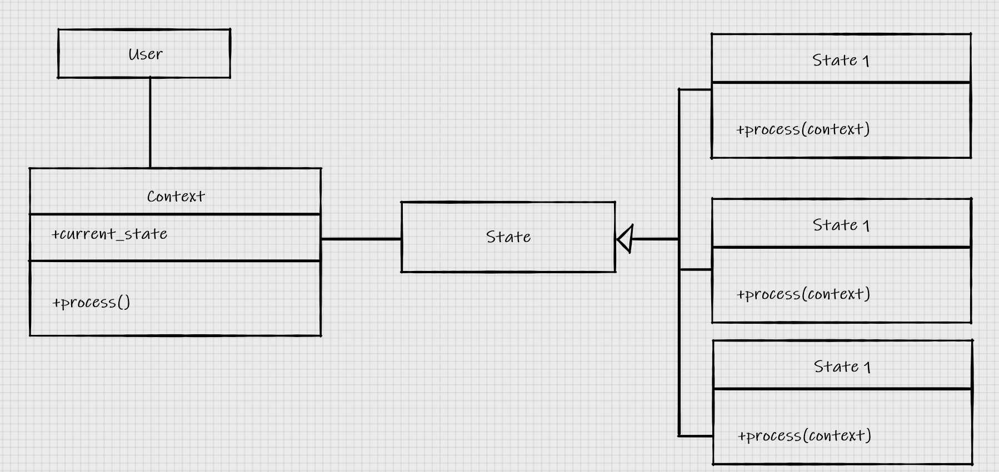

Here is an example in code:

```Python
class Context:
    def __init__(self):
        self.current_state = None

    def process(self):
        print("Processing ... ")
        self.current_state = FirstState("First state").process(self)

class BaseStateClass:
    def __init__(self, state):
        self.state = state


class FirstState(BaseStateClass):
    def process(self, manager):
        print("You are inside the first state. We are going to change to the second state")
        manager.current_state = SecondState("Second state").process(manager)


class SecondState(BaseStateClass):
    def process(self, manager):
        print("You are inside the second state. We are going to change to the third state")
        manager.current_state = ThirdState("Third state").process(manager)


class ThirdState(BaseStateClass):
    def process(self, manager):
        print("You are inside the first state. We will stop the cycle")
        manager.current_state = None


if __name__ == '__main__':
    Context().process()

"""
Output:
Processing ... 
You are inside the first state. We are going to change to the second state
You are inside the second state. We are going to change to the third state
You are inside the first state. We will stop the cycle
"""
```

We change from the first state to the second state to the third state and then we stop the cycle.

> While the two patterns ahve identical structures, their purposes are very different. The strategy pattern is used to choose an algorithm at runtime; generally, only one of those algorithms is going to be chosen for a particular use case. The state pattern, on the other hand is designed to allow switching between different state dynamically, at some process evolves. In code, the primary difference is that the strategy pattern is not typically aware of other strategy objects. In the state pattern, either the state or the context needs to know which other state that it can switch to.

## Singleton Pattern ( don't use it )

> The basic idea behind the singleton patter nis to allow exactly one instance of a certain object to exist. Such objects often need to be referenced by a wide variety of other objects, and passing references to the manager object around to the method and constructors that need them can make code hard to read.
> Instead, when a singleton is used, the seperate objects request the single instance of the manager object from the class, so a reference to it does not need to be passed around.

The singleton pattern states that you can make a globally accessible instance of a class that can only be instantiated once.

This is the UML structure:


This is, however, a pattern that should be avoided, since it can interfere with threading/parallel programming, automated testing etc.

Here is how you could implement it in Python ( technically, the constructor of a singleton is private, but we can't do that in Python ):

```Python
class OneOnly:
    _singleton = None

    def __new__(cls, *args, **kwargs):
        if not cls._singleton:
            cls._singleton = super(OneOnly, cls).__new__(cls, *args, **kwargs)

        return cls._singleton


if __name__ == '__main__':
    o1 = OneOnly()
    o2 = OneOnly()

    print(o1 == o2) # True
    print(o1)
    print(o2)
```

##  Template pattern

> The template pattern is useful for removing duplicate code; it's an implementation to support the DRY ( "don't repeat yourself" ) principle. It is designed for situations where we ahve several different tasks to accomplish that have some, but not all, steps in common. The common steps are implemented in a base class, and the different stpes are overriden in subclasses to provide custom behavior. In some ways, it's like a generalized strategy pattern, except similar sections of the algorithms are shared using a base class

The template pattern contains a base class with all the common operations that the sub classes might use and then contains multiple sub classes that have specific operations.
jo
Here is the structure for the template pattern:

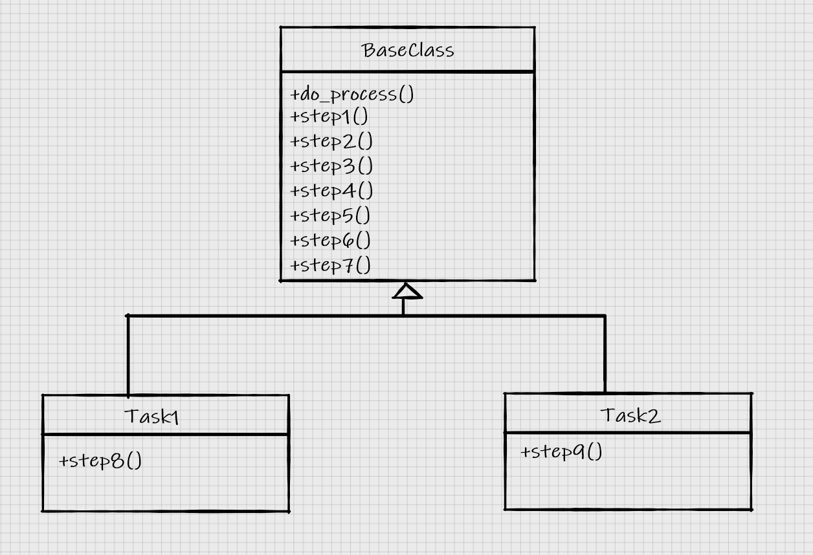

# Chapter 9: Python Design Pattern II

## Adapter Pattern

> ***The adapter pattern is designed to interact with existing code***. We would not design a brand new set of objects that implement the adapter pattern. Adapters are used to allow two pre-existing objects to work together, even if their interfaces are not compatible. Like the keyboard adapters that allow USB keybaord to be plugged into PS/2 ports, an adapter object sits between two different interfaces, translating between them on the fly. The adapter object's sole purpose is to perform this translating job; translating may entail a variety of tasks, such as converting arguments to a different format, rearranging the order of arguments, calling a differently named method, or supplying default arguments.
> In structure, tthe adapter pattern is similar to a simplified decorator pattern. Decorators typically provide the same interface that they replace, whereas adapters  map between two different interfaces.

The adapter pattern describes creating an object that connects two interfaces together. Instead of copying code and making it work, by just making small adjustments to it, from one interface to another, it is better to make an "adapter" class that connects the two interfaces together. That means that you have a class that rearranges certain methods so that they work on both sides, without having to copy code and only make small adjustments to it, since that would be the DRY ( don't repeat yourself )principle.

Here is the UML structure for the adapter pattern:

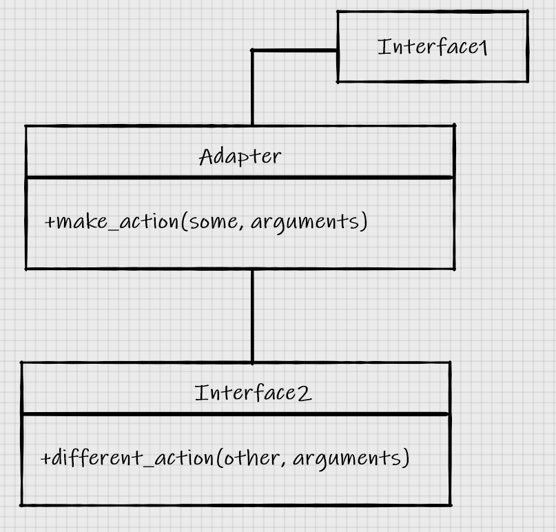

> Here, Interface 1 is expceting to call a methdo called **make_action(some, arguments)**. We already have this perfect Interface2 class that does everything we want ( and to avoid duplication, we don't want to rewrite it! ), but it provides a method called different_action(other, arguments) instead. The Adapter class implements the **make_action** interface and maps the arguments to the existing interface.
> The advantage here is that the code that maps from one interface to another is all in one place. The alternative would be to translate it directly in multiple places whnever we need to access this code.

Here is an example in code:

```Python
import datetime


class AgeCalculator:
    def __init__(self, birthday):
        self.year, self.month, self.day = (
            int(x) for x in birthday.split("-")
        )

    def calculate_age(self, date):
        year, month, day = (int(x) for x in date.split("-"))
        age = year - self.year
        if (month, day) < (self.month, self.day):
            age -= 1

        return age


class DateAgeAdapter:
    def _str_date_(self, date):
        return date.strftime("%Y-%m-%d")

    def __init__(self, birthday):
        birthday = self._str_date_(birthday)
        self.calculator = AgeCalculator(birthday)

    def get_age(self, date):
        date = self._str_date_(date)
        return self.calculator.calculate_age(date)
```

In this case our first interface is **AgeCalculator**. However, if we want to use **datetime**, we will need an adapter that connect the **AgeCalculator**, that adapter is the **DateAgeAdapter**. This adapter converts **datetime.date**/**datetime.time** into a string that the original **AgeCalculator** can use.

### Summary and C# Example

The adapter pattern converts the interface of a class into another interface. The adapter let's classes work togehter that couldn't otherwise because of incompatible interfaces. The adapter pattern converts the interface of one class into another interface that a **client** ( user code, not specifically a class ) expects.

Here is a representation of the adapter pattern in UML and the code in C#:

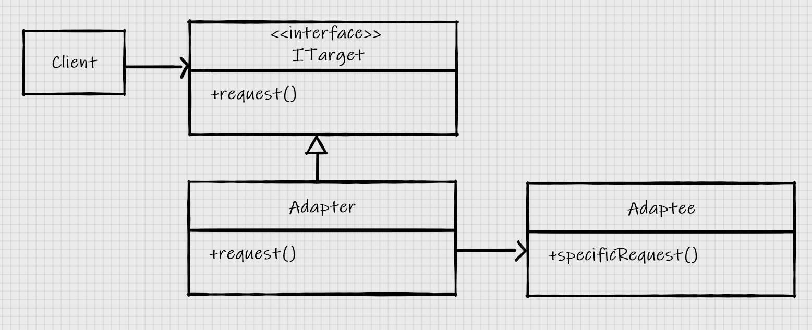

Remember that the **Client** is not an actual class, although it could be but it doesn't have to. The **Client** refers to normal code, it refers to your application. The application wants to use a variable that implements the interface **ITarget**. However, you want to use the **specificRequest** method from the **Adaptee** ( adaptee is the thing that the adapter needs, it's the thing that needs to be adapted to your normal code ). In order to do that you use the class **Adapter** that inherits from the interface that you want your variable to have, that being **ITarget** and, inside the implementation of the **request()** method, it calls the **specificRequest()** method from the Adaptee class.

Here is the code in C#:

```Csharp
class Program
{
    static void Main(string[] args)
    {
        // Client 
        ITarget target = new Adapter(new Adaptee());
        target.request();
    }
}
interface ITarget
{
    void request();
}
class Adapter : ITarget
{
    private Adaptee adaptee;
    public Adapter(Adaptee a)
    {
        this.adaptee = a;
    }
    public void request()
    {
        this.adaptee.specificRequest();
    }
}
class Adaptee
{
    public void specificRequest()
    {
        // Code
    }
}
```

## Facade Pattern

> The facade pattern is designed to provide a simple interface to a complex system of components. The objects in this system may need to be interfact with directly for complex tasks and interactions. Often, however, there is 'typical' usage for the system, and these complicated interactions aren't necessary in that common scenario. The facade pattern allows us to define a new object taht wraps this typical usage of the system. Any code that wants to use the typical functionality can use the single object's simplified interface. If another project or part of the project finds this interface is too simple and needs to access more complicated functionality, it is still able to interfact with the system directly.
> Facade is, in many ways, like adapter. The primary difference is that the facade is trying to abstract a simpler interface out of a complex system; the adapter is only trying to map one existing interface to another.

When using the facade pattern you can build a class that is a simplified version of a complex system. You can stil use the complex system if you ever need it.

Here is the UML structure:

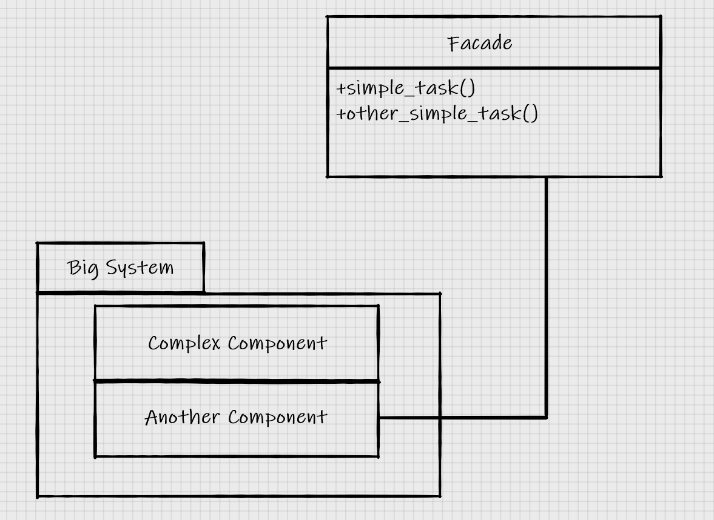

Here is an example in python where we have 2 complex systems ( smtplib, imaplib ) and we have built a Facade for those systems that sends emails and gets an inbox of emails called **EmailFacade**:

```Python
import smtplib
import imaplib


class EmailFacade:
    def __init__(self, host, username, password):
        self.host = host
        self.username = username
        self.password = password

    def send_email(self, to_email, subject, message):
        if not "@" in self.username:
            from_email = "{0}@{1}".format(self.username, self.host)
        else:
            from_email = self.username

        message = "From: {0}\r\nTo: {1}\r\nSubject: {2}\r\n\r\n{3}".format(
            from_email, to_email, subject, message
        )

        smtp = smtplib.SMTP(self.host)
        smtp.login(self.username, self.password)
        smtp.sendmail(from_email, [to_email], message)

    def get_inbox(self):
        mailbox = imaplib.IMAP4(self.host)
        mailbox.login(bytes(self.username, 'utf8'), bytes(self.password, 'utf8'))
        mailbox.select()
        x, data = mailbox.search(None, "ALL")
        messages = []
        for num in data[0].split():
            x, message = mailbox.fetch(num, '(RFC822)')
            messages.append(message[0][1])

        return messages
```

## Flyweight Pattern

> The flywegiht pattern is a memory optimization pattern. In real life, the flyweight patter nis often implemented only after a program has demonstrated memory problems. It may make sense to design an optimal configuration from the beginning in some situations, but bear in mind that premature optimization is the most effective way of ensuring that your program is too complicated to maintain.
> The basic idea behind the flyweight pattern is to ensure that boejcts that share a state can use the same memory for that shared state.

The flyweight pattern states that when you have a lot of objects that share certain states ( a state can be either a property or the implementation of a method ), you should create a general object that contains all of these states, instead of just using all these common states on each individual object. By doing that you free a lot of memory.

There is a very big difference in memory between a class with 200 properties and 100 methods and a class with 5 properties and 2 methods. There is also a very big difference in memory between two objects of such type and 100.000 objects of such type.
 
Let's say that you have a class ```A``` that has 30 properties and 20  methods. In this example your program creates 100.000 objects of that type. However, if you look at your objects, you can see that 20 properties out of those 30, repeat themselves in most cases, and 10 methods out of the 20 also repeat themselves in most cases.
In this example you can implement the flyweight pattern.
You have a ```FlyweightFactory``` class that creates a general ```Flyweight``` based on an identifier. The ```Flyweight``` class contains the general states that will be shared by multiple objects. In the end you have your ```SpecificState``` class that uses a general ```Flyweight``` object, that is also implemented by other classes.
The objects that before had individual common states, will now have 1 common property that will point to a ```Flyweight``` object on the heap that will contain all the shared states. That will reduce the memory used.

Here is the UML structure of the flyweight pattern:

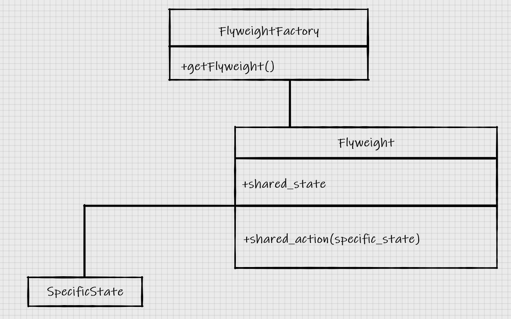
(In this case a state is a property and an action is a method )

Here a visual example of how the memory usage would change by using the Flyweight Pattern:

Before implementing the flyweight pattern:

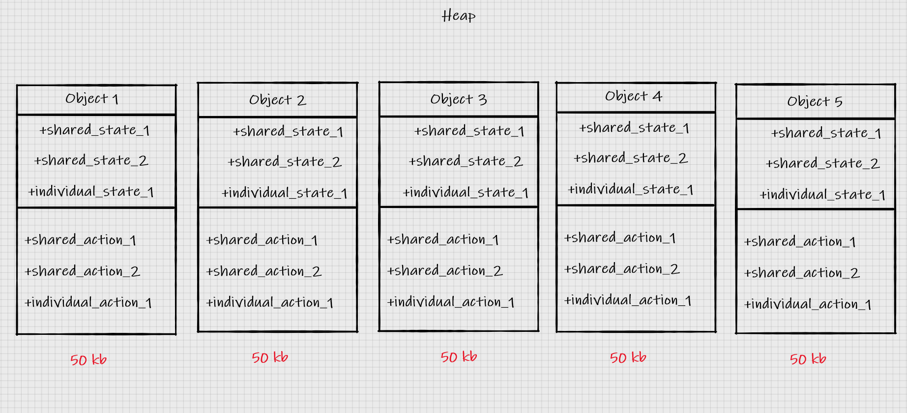

After implementing the flyweight pattern:

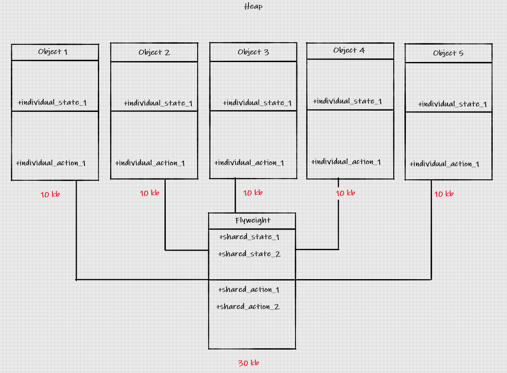

The UML Diagram isn't implemented correctly but you get the idea

Just from this simple implementation, you can see that the memory has dropped from 250 kb ( before the flyweight pattern ) to 80 kb ( after the flyweight pattern ). The difference would be even bigger if we would have 100.000 such objects.

Here is an implementation in Python:

```Python
class CarModel:
    _models = {}  # { model_name : model object }

    def __new__(cls, model_name, *args, **kwargs):
        # Flyweight Factory for car models
        if model_name in cls._models.keys():
            print("RETURN CACHED CAR MODEL FROM __new__")
            return cls._models[model_name]
        else:
            print("BUILD NEW CAR MODEL AND CACHE IT IN __new__")
            model = super().__new__(cls)
            print(id(model))
            cls._models[model_name] = model

        return model

    def __init__(self, model_name, property_1=False, property_2=False, property_3=False, property_4=False,
                 property_5=False):
        print("__inited__ 1")
        if not hasattr(self, "innited"):
            print("__inited__ 2")
            self.model_name = model_name
            self.property_1 = property_1
            self.property_2 = property_2
            self.property_3 = property_3
            self.property_4 = property_4
            self.property_5 = property_5
            self.innited = True

    def check_serial(self, serial_number):
        print("Sorry, we are unable to check the serial number {0} int the {1} at this time".format(
            serial_number, self.model_name
        ))


class Car:
    def __init__(self, model, color, serial):
        self.model = model
        self.color = color
        self.serial = serial

    def check_serial(self):
        return self.model.check_serial(self.serial)


if __name__ == '__main__':
    dx_all_false = CarModel("FIT DX")
    print("-"*25)
    lx_1_3 = CarModel("FIT LX", property_1=True, property_3=True)
    print("-"*25)

    for item in CarModel._models.items():
        model_name, model = item
        print("model name -- > {0}".format(model_name))
        print("model -- > {0}".format(model))
        print("model id -- > {0}".format(id(model)))
        print("model property 1 -- > {0}".format(model.property_1))
        print("model property 2 -- > {0}".format(model.property_2))
        print("model property 3 -- > {0}".format(model.property_3))
        print("model property 4 -- > {0}".format(model.property_4))
        print("-"*25)
```

The ```FlyweightFactory``` is implemented by using the ```__new__``` constructor.

## Command Pattern

> The command pattern adds a level of abstraction between actions that must be done, and the object that invokes those actions, normally at a later time. In the command pattern, client code creates a ```Command``` object that can be executed at a later date. This object konws about a receiver object that amanges its own internal state when the command is executed on it. The ```Command``` object implements a specific interface ( typically it has an ```execute``` or ```do_action``` method ), and also keeps track of any arguments required to perform the action. Finally, one or more Invoker objects execute at the correct time.
> A common example of command pattern in action is actions on a grahpical window. Often, an action can be invoked by a mneu item on the menu bar, a keyboard shortcut, a toolbar icon, or a context menu. These are all examples of Invoker objects. The actions that actually occur, such as ```exit```, ```save``` or ```copy``` are all command implementations of ```CommandInterface```. A GUI Window to recieve exit, document to receive save, and ```ClipboardManager``` to receive copy commands are all examples of possible ```Receivers```.

So the command pattern allows you to map certain invokers to commands. You, the client, invoke certain invokers that invoke certain commands that interact with the receivers

Here is the UML Diagram:

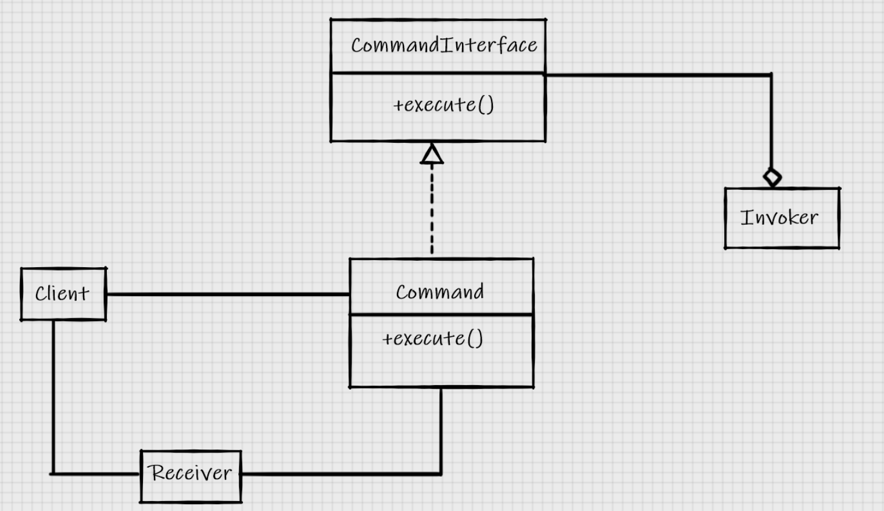

Here is an implementation in python:

```Python
import sys

root = Folder("")
def get_path(path):
    names = path.split("/")[1:]
    node = root
    for name in names:
        node = node.children[name]

    return node


class Window:
    def exit(self):
        sys.exit(0)


class Document:
    def __init__(self, filename):
        self.filename = filename
        self.contents = "This file cannot be modified"

    def save(self):
        with open(self.filename, "w") as file:
            file.write(self.contents)


class ToolbarButton:
    def __init__(self, name, iconname):
        self.name = name
        self.iconname = iconname

    def click(self):
        self.command.execute()


class MenuItem:
    def __init__(self, menu_name, menuitem_name):
        self.menu = menu_name
        self.item = menuitem_name

    def click(self):
        self.command.execute()


class KeyboardShortcut:
    def __init__(self, key, modifier):
        self.key = key
        self.modifier = modifier

    def keypress(self):
        self.command.execute()


class SaveCommand:
    def __init__(self, document):
        self.document = document

    def execute(self):
        self.document.save()


class ExitCommand:
    def __init__(self, window):
        self.window = window

    def execute(self):
        self.window.exit()


if __name__ == '__main__':
    # Receivers
    window = Window()
    document = Document("a_document.txt")
    # Commands
    save = SaveCommand(document)
    exit = ExitCommand(window)

    # Invokers
    save_button = ToolbarButton("save", "save.png")
    save_keystroke = KeyboardShortcut("s", "ctrl")
    exit_menu = MenuItem("File", "Exit")

    # Setting the commands on the invokers
    save_button.command = save
    save_keystroke.command = save
    exit_menu.command = exit

    # You ( the client ) invoke the invokers that invoke the commands that interact with the receivers
```

The most important part of the implementation in order to fully grasp the command pattern is the last part:

```Python
# Receivers
window = Window()
document = Document("a_document.txt")
# Commands
save = SaveCommand(document)
exit = ExitCommand(window)

# Invokers
save_button = ToolbarButton("save", "save.png")
save_keystroke = KeyboardShortcut("s", "ctrl")
exit_menu = MenuItem("File", "Exit")

# Setting the commands on the invokers
save_button.command = save
save_keystroke.command = save
exit_menu.command = exit

# You ( the client ) invoke the invokers that invoke the commands that interact with the receivers
```

We have certain ```Invokers``` ( ```ToolbarButton```, ```KeyboardShortcut```, ```MenuItem```). These invokers will invoke a command ( ```SaveCommand```, ```ExitCommand``` ). The commands will, in the end, interfact with certain receivers ( ```window```, ```document``` ). 
For example: if you use the keyboard shortcut ```ctrl+s``` ( which is an ```Invoker``` ), you have invoked the ```save``` command. The ```save``` command then, interacts with a ```Receiver```, that in our case being the ```Window```.

## Abstract factory pattern

> The abstract factory pattern is normally used when we have multiple possible implementations of a system that depend on some configuration or platform issue. The calling code requests an objectg from the abstract factory, not knowing exactly what class of object will be retruned. The underlying implementation returned may depend on a varierty of factors, such as current locale, operating system, or local configuration.

The abstract factory pattern is used when we have multiple implementations that are depend on some configuration or platform. The implementations of the factories all inherit one certain instance.

Here is an example with an UML Diagram:

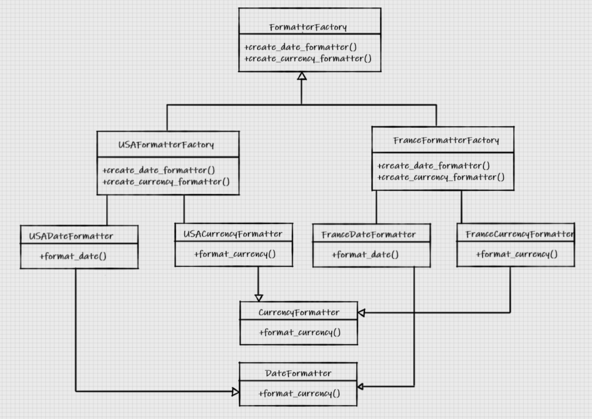

Here is the example in python, without interfaces:

```Python
class FranceDateFormatter:
    def formate_date(self, y, m, d):
        y, m, d = (str(x) for x in (y, m, d))
        y = '20{0}'.format(y if len(y) == 2 else y)
        m = '0{0}'.format(m if len(m) == 1 else m)
        d = '0{0}'.format(d if len(d) == 1 else d)
        return "{0}/{1}/{2}".format(d, m, y)


class USADateFormatter:
    def format_date(self, y, m, d):
        y, m, d = (str(x) for x in (y, m, d))
        y = '20{0}'.format(y if len(y) == 2 else y)
        m = '0{0}'.format(m if len(m) == 1 else m)
        d = '0{0}'.format(d if len(d) == 1 else d)
        return "{0}-{1}-{2}".format(m, d, y)


class FranceCurrencyFormatter:
    def format_currency(self, base, cents):
        base, cents = (str(x) for x in (base, cents))
        if len(cents) == 0:
            cents = "00"
        elif len(cents) == 1:
            cents = f"0{cents}"

        digits = []
        for i, c in enumerate(reversed(base)):
            if i and not i % 3:
                digits.append(' ')
            digits.append(c)

        base = ''.join(reversed(digits))
        return "{0}{1}".format(base, cents)


class USACurrencyFormatter:
    def format_currency(self, base, cents):
        base, cents = (str(x) for x in (base, cents))
        if len(cents) == 0:
            cents = "00"
        elif len(cents) == 1:
            cents = f"0{cents}"

        digits = []
        for i, c in enumerate(reversed(base))
            if i and not i % 3:
                digits.append(",")

            digits.append(c)

        base = ''.join(reversed(digits))
        return "${0}.{1}".format(base, cents)


class USAFormatterFactory:
    def create_date_formatter(self):
        return USADateFormatter

    def create_currency_formatter(self):
        return USACurrencyFormatter()


class FranceFormatterFactory:
    def create_date_formatter(self):
        return FranceDateFormatter()

    def create_currency_formatter(self):
        return FranceCurrencyFormatter()


if __name__ == '__main__':
    country_code = "US"
    factory_map = {
        "USA" : USAFormatterFactory,
        "FR" : FranceFormatterFactory
    }
    formatter_factory = factory_map.get(country_code)()
```

So we have 2 format factories (```USAFormatterFactory``` and ```FranceFormatterFactory```) containing two types of formatters ( ```DateFormatter``` and ```CurrencyFormatter``` ). Depending on the country, the interface stays the same, but the implementation changes. This allows you to change be more flexible depending on certain configurations.

## Composite Pattern

> The composite pattern allows complex tree-like structures to be built from simple components. Composite objects are simply container objects, where teh content may actually be another composite object.

The composite pattern has a tree structure. You have a component class that represents an interface. The composite pattern also contains a Composite class that overrides the method some_action() and is also able to connect to another child element. The leaf element, just like in trees, doesn't have any other child elements but can still perform an action

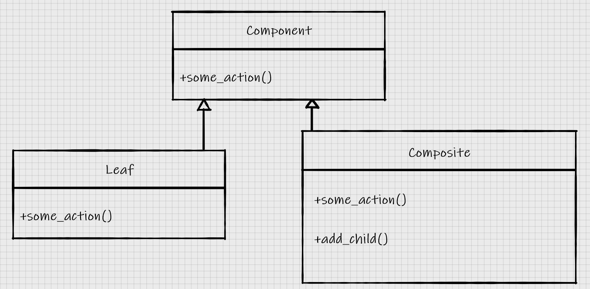

Here is a folder/file structure where the composite pattern is implemented:

```Python
class Component:
    def __init__(self, name):
        self.name = name

    def move(self, new_path):
        new_folder = get_path(new_path)
        del self.parent.children[self.name]
        new_folder.children[self.name] = self
        self.parent = new_folder

    def delete(self):
        del self.parent.children[self.name]


class Folder(Component):
    def __init__(self, name):
        super().__init__(name)
        self.children = {}

    def add_child(self, child):
        child.parent = self
        self.children[child.name] = child

class File(Component):
    def __init__(self, name, contents):
        super().__init__(name)
        self.contents = contents

```